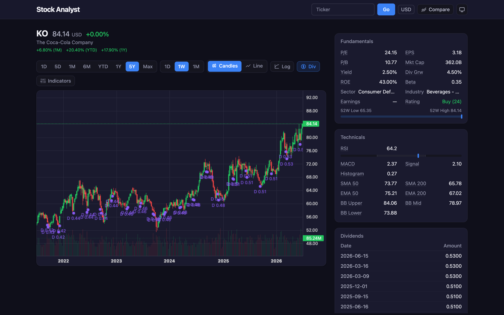
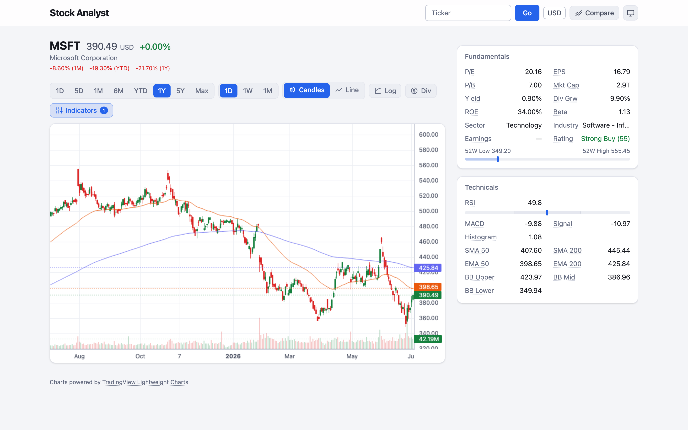

# Stock Analyst UI


Interactive stock analysis dashboard built with React and [lightweight-charts](https://github.com/nicosommi/lightweight-charts). Connects to the [stock-analyst](https://github.com/krbob/stock-analyst) API backend.

<p>
  <a href="docs/screenshot-main.png"></a>
  <a href="docs/screenshot-indicators.png"></a>
  <a href="docs/screenshot-compare.png"></a>
  <a href="docs/screenshot-dividends.png"></a>
  <a href="docs/screenshot-light.png"></a>
</p>

## Features

**Charting**
- Candlestick and line chart modes
- Logarithmic scale
- 8 time periods (1D to Max) with automatic intraday/daily interval selection
- Manual interval override (1m, 5m, 15m, 30m, 1h / 1D, 1W, 1M)
- Live intraday updates (auto-refresh every 30s)
- Dividend markers on chart

**Technical indicators**
- Moving averages: SMA 50/200, EMA 50/200
- Bollinger Bands (upper, middle, lower)
- RSI (14-period) in a separate pane with 70/30 reference lines
- MACD (line, signal, histogram) in a separate pane

**Fundamentals & technicals panel**
- P/E, EPS, P/B, Market Cap, ROE, Beta, Dividend Yield/Growth
- RSI (daily/weekly/monthly), MACD, Bollinger Bands, Moving Averages, ATR
- 52-week high/low, sector, industry, next earnings date
- Analyst consensus rating with count
- Tooltips explaining each metric

**Compare mode**
- Side-by-side comparison of up to 6 stocks
- Normalized percentage overlay chart
- Comparison table with fundamental and performance metrics
- Best-in-group highlighting

**Other**
- Currency conversion (150+ currencies via the API)
- Shareable URLs — full chart state encoded in query parameters
- Ticker search with autocomplete and recent history
- Dark theme, fully responsive
- Quote/history/compare provenance bars with source, coverage, market freshness and unit semantics

## Quick start

### Docker Compose (with backend)

The easiest way to run the full stack:

```yaml
services:
  stock-analyst-ui:
    image: ghcr.io/krbob/stock-analyst-ui:latest
    ports:
      - "3001:8080"
    depends_on:
      - stock-analyst
    environment:
      - API_URL=http://stock-analyst:8080
      # Optional: hide the chart attribution footer on a private local stack.
      - SHOW_CHART_ATTRIBUTION=${SHOW_CHART_ATTRIBUTION:-true}
      # Optional: enable the Portfolio app switcher without rebuilding the UI.
      - PORTFOLIO_URL=${PORTFOLIO_URL:-}
    restart: unless-stopped

  stock-analyst:
    image: ghcr.io/krbob/stock-analyst:main
    ports:
      - "8080:8080"
    depends_on:
      - stock-analyst-backend-yfinance
    environment:
      - BACKEND_URL=http://stock-analyst-backend-yfinance:8081
    restart: unless-stopped

  stock-analyst-backend-yfinance:
    image: ghcr.io/krbob/stock-analyst-backend-yfinance:main
    restart: unless-stopped
```

```bash
docker compose up
# Open http://localhost:3001
```

### Development

Requires the [stock-analyst](https://github.com/krbob/stock-analyst) API running on port 8080 (Vite proxies `/api/*` to it automatically). Runtime market-data calls use only the canonical `/v1` API paths.

The UI expects intraday `timestamp` values from the API to be standard UTC epoch seconds and surfaces backend error messages directly, including `422` responses when currency conversion is unavailable for a symbol. History responses are matched against the current request before rendering so quick symbol/currency changes do not flash stale chart or indicator data.

Every quote and history response carries the generated, nested `DataProvenance` contract. The UI displays its provider, actual coverage, retrieval time, optional market timestamp, response currency, adjustment basis, unit scale and market-observation status. `retrievedAt` describes when the API obtained the response; `status` is the backend's cadence-aware assessment of the latest market observation, so the UI keeps the two concepts separate and never infers freshness locally.

```bash
npm install
npm run dev
# Open http://localhost:5173
```

For a private local Vite session, create `.env.local` with `VITE_SHOW_CHART_ATTRIBUTION=false` to hide the chart attribution footer.
Set `VITE_PORTFOLIO_URL` there to a root-relative or absolute HTTP(S) URL to enable the local Portfolio app switcher.

## URL parameters

Chart state is encoded in the URL for sharing:

| Parameter | Example           | Description                              |
|-----------|-------------------|------------------------------------------|
| `s`       | `AAPL`            | Stock symbol                             |
| `p`       | `1y`              | Period (1d, 5d, 1mo, 6mo, ytd, 1y, 5y, max) |
| `i`       | `1wk`             | Interval override                        |
| `line`    | `1`               | Line chart mode                          |
| `log`     | `1`               | Logarithmic scale                        |
| `div`     | `1`               | Show dividends                           |
| `ind`     | `sma50,sma200,rsi`| Active indicators (comma-separated)      |
| `cur`     | `EUR`             | Currency conversion                      |
| `cmp`     | `AAPL,MSFT,GOOG`  | Compare mode symbols (comma-separated)   |

Example: `?s=AAPL&p=5y&log=1&ind=sma50,sma200&cmp=AAPL,MSFT`

## Architecture

```
Browser → Nginx (:8080) → /api/* → stock-analyst API (:8080)
                       → /*    → React SPA (index.html)
```

### Project structure

```
src/
├── api/            Generated OpenAPI client, UI adapters and React Query hooks
├── components/     UI components
│   ├── PriceChart      Interactive chart (lightweight-charts)
│   ├── StockDetails    Fundamentals & technicals panels
│   ├── CompareView     Multi-stock comparison
│   ├── TickerSearch    Search with autocomplete
│   └── CurrencyPicker  Currency selector dropdown
├── data/           Currency definitions (Intl API)
├── hooks/          Custom hooks (useDebounce)
├── styles/         Versioned, framework-neutral design-token contract
├── url-state.ts    URL ↔ state serialization
├── App.tsx         Main layout and state management
└── main.tsx        Entry point
```

### Design-token contract

`src/styles/tokens.css` is the portable UI contract shared at CSS custom-property level. It separates raw `primitive` values from the stable `semantic` API and chart-specific `component` roles, with light, dark and system-theme mappings. The Tailwind aliases in `src/index.css` are an adapter only; another application can consume the public `--ui-*` semantic/component tokens without using Tailwind or React.

`src/styles/tokens.manifest.json` records the contract version, SHA-256 digest and complete layer inventory. Run `npm run tokens:check` after any token change; intentional contract changes require updating the manifest version and digest. Consumers should pin a compatible manifest version and must not depend on private `--ui-ref-*` primitives.

### OpenAPI client contract

`openapi/stock-analyst-v1.json` is a pinned snapshot of the Stock Analyst API contract from the commit recorded in `openapi/manifest.json`. The manifest contains both the snapshot SHA-256 and a deterministic hash of every file under `src/api/generated`. Runtime types and operation functions are generated by the exactly pinned `@hey-api/openapi-ts` version; `src/api/client.ts` only adapts the generated response into UI request identity and the local `ApiError` class.

The checked-in snapshot makes generation independent of a sibling checkout and network access:

```bash
npm run contract:generate  # regenerate SDK/types and update their tree hash
npm run contract:check     # regenerate in a temp directory and fail on any drift
npm run contract:test      # Node contract test used by npm test
```

When the backend contract changes, intentionally replace the snapshot, update its source commit and SHA-256 in the manifest, then run `contract:generate`. Never edit `src/api/generated` by hand.

### Key dependencies

| Library | Purpose |
|---------|---------|
| [lightweight-charts](https://github.com/nicosommi/lightweight-charts) | Financial charting (TradingView) |
| [TanStack Query](https://tanstack.com/query) | Server state, caching, auto-refetch |
| [Hey API](https://heyapi.dev/) | Deterministic OpenAPI types and Fetch SDK |
| [Tailwind CSS](https://tailwindcss.com) | Styling |
| React 19 | UI framework |

## Scripts

```bash
npm run dev          # Start dev server (port 5173)
npm run build        # Type check + production build
npm run lint         # ESLint
npm test             # Run tests (Vitest)
npm run test:watch   # Tests in watch mode
npm run test:e2e:ci # Production-browser smoke, keyboard and axe WCAG A/AA checks
npm run contract:check     # Verify OpenAPI snapshot/client drift
npm run contract:generate  # Regenerate the pinned API client
```

## Docker

Multi-stage build: Node 24 for compilation, Nginx Alpine for serving.

```bash
# Build
docker build -t stock-analyst-ui .

# Run
docker run -p 3001:8080 -e API_URL=http://your-api:8080 stock-analyst-ui
```

The `API_URL` environment variable is required and is substituted into the Nginx config at container startup.
Set `SHOW_CHART_ATTRIBUTION=false` on a private local container if you want to hide the chart attribution footer without rebuilding the image.
Set optional `PORTFOLIO_URL` at container startup to enable the Portfolio app switcher. Invalid, executable-scheme, protocol-relative and credential-bearing URLs are not rendered. The link carries only `uiTheme` and canonical `uiLocale` preferences; it never forwards the selected symbol or other market data.

## CI/CD

GitHub Actions pipeline (`.github/workflows/ci-build.yml`):

1. **Contract check** — pinned OpenAPI snapshot and generated SDK drift
2. **Type check** — `tsc --noEmit`
3. **Lint** — ESLint
4. **Test** — Node contract test and Vitest
5. **Docker build** — multi-stage image
6. **Browser/a11y smoke** — production container, canonical `/v1` requests, keyboard flows, axe WCAG A/AA, 320/375 px and offline shell
7. **Publish** (main only) — push to `ghcr.io/krbob/stock-analyst-ui`

## Tech stack

| Component | Technology |
|-----------|------------|
| Framework | React 19, TypeScript 5.9 |
| Build | Vite 7 |
| Styling | Tailwind CSS 4 |
| Charts | lightweight-charts 5 |
| State | TanStack Query 5 |
| Testing | Vitest, React Testing Library |
| CI/CD | GitHub Actions |
| Deployment | Docker (Nginx Alpine), GHCR |
